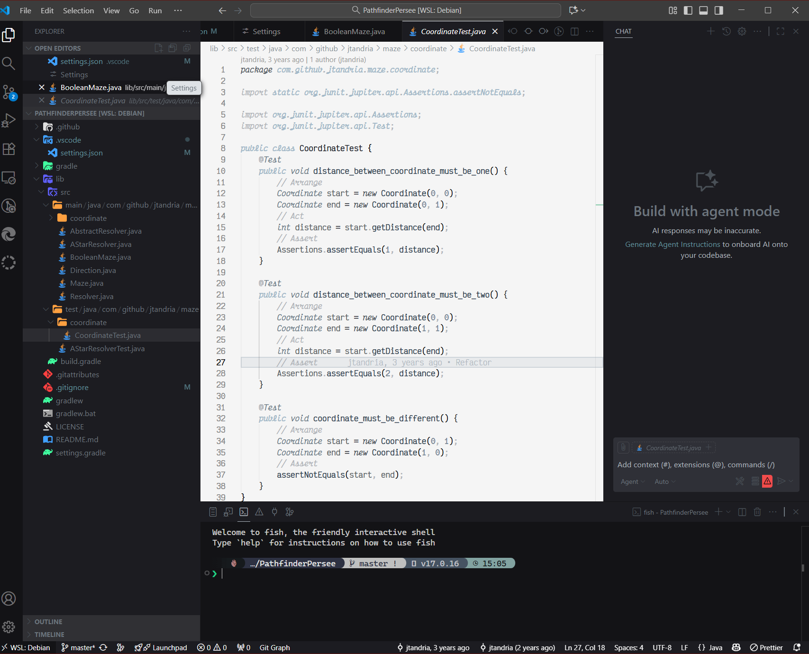

# bnw-colors &mdash; Markdown sample

A **bold** claim, an *emphasised* aside, some `inline code`, a ~~retraction~~,
and a [link](https://github.com/blaccorek/vscode-bnw-colors-theme "Repository").

> Subtle syntax colors, high contrast where it matters.
>
> > Nested quote with a footnote reference.[^1]

## Lists

1. Ordered item
2. Second item
   - Nested bullet
   - Another one
     1. Deeply nested
3. Third item

- [x] Write samples
- [ ] Take screenshots
- [ ] Publish `0.1.0`

## Table

| Language   | Folder              | Tokens covered              |
| :--------- | :------------------ | --------------------------: |
| TypeScript | `samples/web`       |                          42 |
| Terraform  | `samples/infra`     |                          31 |
| SQL        | `samples/data`      |                          28 |

## Code

```ts
export const greet = (name: string): string => `Hello, ${name}!`;
```

```hcl
resource "aws_s3_bucket" "artifacts" {
  bucket = "bnw-artifacts"
}
```

    Indented code block (four spaces).

## Definitions and rules

Term
: A definition list entry, rendered by some parsers.

---

***

## Extras

Image: 

Autolink: <https://example.com>

HTML block:

<details>
  <summary>Click to expand</summary>
  <p>Raw HTML inside Markdown.</p>
</details>

Math (if supported): $E = mc^2$

Hard break at the end of this line\
continues here.

[^1]: Footnote text with a [nested link](https://example.com).
